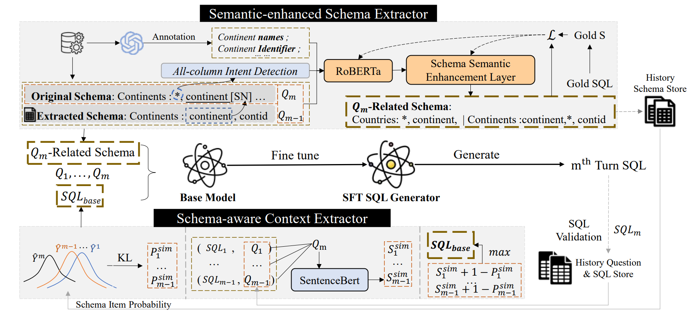

# Track-SQL: Enhancing Generative Language Models with Dual-Extractive Modules for Schema and Context Tracking in Multi-turn Text-to-SQL
NAACL 2025 Submission

## Project Overview

Track-SQL is a novel framework designed to boost multi-turn Text-to-SQL performance by integrating dual-extractive modules for precise schema and context tracking. Built on state-of-the-art generative language models, this work addresses key challenges in multi-turn dialogue scenarios—including schema confusion and context drift—through structured module design and optimized training pipelines.

## Environment Setup
### Hardware Requirements
- GPU: ≥ 2 × NVIDIA RTX 3090/4090 (24GB VRAM) for training; ≥ 1 × NVIDIA RTX 3090/4090 for inference
- CUDA Version: 11.8 (compatible with PyTorch 2.1.0)
- CPU: Intel Xeon Platinum 83xx series or equivalent; ≥ 64GB RAM
- OS: Ubuntu 20.04 LTS / CentOS Linux 7

### Software Installation
Create a dedicated Conda environment and install dependencies:
```bash
# Create and activate environment
conda create -n track-sql python=3.10
conda activate track-sql

# Install PyTorch with CUDA 11.8 support
pip install torch==2.1.0+cu118 torchvision==0.16.0+cu118 torchaudio==2.1.0+cu118 --index-url https://download.pytorch.org/whl/cu118

# Install additional dependencies
python -m pip install -r requirements.txt

# Optional: Install Flash-Attention for memory efficiency (requires CUDA ≥ 11.7)
pip install flash-attn==2.0.0.post1
```

## Dataset Preparation
We evaluate Track-SQL on two standard multi-turn Text-to-SQL benchmarks: SparC and CoSQL. Follow the steps below to download and preprocess the data.

### 1. Create Data Directories
```bash
mkdir -p data raw_data preprocessed_data metrics/ts_database
```

### 2. Download Benchmark Datasets
| Dataset | Download Link | Notes |
|---------|---------------|-------|
| SparC | [Google Drive](https://drive.usercontent.google.com/download?id=1Uu7NMHTR1tdQw1t7bAuM7OPU4LElVKfg&export=download) | Multi-turn cross-domain SQL dataset |
| CoSQL | [Google Drive](https://drive.usercontent.google.com/download?id=1Y3ydpFiQQ3FC0bzdfy3groV95O_f1nXF&export=download) | Conversational SQL dataset with execution feedback |
| Test-Suite Databases | [Google Drive](https://drive.google.com/file/d/1mkCx2GOFIqNesD4y8TDAO1yX1QZORP5w/view) | Evaluation databases for SQL execution testing |

### 3. Extract Datasets
```bash
# Move downloaded files to raw_data directory
mv sparc.zip cosql_dataset.zip testsuitedatabases.zip raw_data/

# Extract SparC and CoSQL
unzip raw_data/sparc.zip -d data/
unzip raw_data/cosql_dataset.zip -d data/

# Extract test-suite databases
unzip raw_data/testsuitedatabases.zip -d metrics/ts_database/
```

> **Note**: If Google Drive links are inaccessible (e.g., regional restrictions), please refer to the [official dataset repositories](https://yale-lily.github.io/sparc) or contact the authors for alternative access.

## Usage Instructions
Follow the sequential steps below to reproduce the results of Track-SQL. All scripts are provided in the `preprocess/`, `train/`, and `inference/` directories.

### Step 1: Data Preprocessing
Preprocess raw datasets (schema parsing, dialogue segmentation, and format conversion) for model training:
```bash
# Preprocess data for Schema Tracking Module 
sh preprocess/scripts/preprocess_sic/sparc.sh
sh preprocess/scripts/preprocess_sic/cosql.sh

# Preprocess data for SQL generation model
sh preprocess/scripts/preprocess_text2sql/sparc.sh
sh preprocess/scripts/preprocess_text2sql/cosql.sh
```

### Step 2: Train Schema Tracking Module 
Train the extractive schema filter to identify relevant table/column items for each dialogue turn:
```bash
# Create checkpoint directory
mkdir -p ckpts/stm

# Train STM on SparC and CoSQL
sh preprocess/scripts/train_sic/sparc.sh
sh preprocess/scripts/train_sic/cosql.sh
```
Trained checkpoints will be saved to `ckpts/stm/`.

### Step 3: Schema Filtering Inference
Apply the trained STM to filter schemas for the SQL generation model:
```bash
sh preprocess/scripts/infer_sic/sparc.sh
sh preprocess/scripts/infer_sic/cosql.sh
```
Filtered data will be saved to `preprocessed_data/`.

### Step 4: Train Track-SQL (SQL Generation Model)
Train the full Track-SQL framework with dual-extractive modules:
```bash
# Create directory for model checkpoints
mkdir -p ckpts/track-sql

# Train on SparC and CoSQL
sh train/scripts/sparc.sh
sh train/scripts/cosql.sh
```
- Training uses DeepSpeed ZeRO-2 for memory optimization (configure via `accelerate config`).
- Adjust `per_device_train_batch_size` in scripts based on GPU memory (default: 4 for A100).

### Step 5: Inference and Evaluation
Generate SQL predictions and evaluate performance using official metrics (Exact Match, Execution Accuracy):
```bash
# Inference on test sets
sh inference/scripts/sparc.sh
sh inference/scripts/cosql.sh
```

## License
This project is licensed under the Apache-2.0 License. See the `LICENSE` file for more details.

## Acknowledgments
We thank the authors of the following projects for their open-source contributions:
- [RUCKBReasoning/codes](https://github.com/RUCKBReasoning/codes) (schema filtering and training pipelines)
- [Yale-Lily/SparC](https://yale-lily.github.io/sparc) and [Yale-Lily/CoSQL](https://yale-lily.github.io/cosql) (benchmark datasets)
- Hugging Face Transformers and DeepSpeed (training frameworks)

## Contact Information
For questions or issues, please open a GitHub issue or contact the corresponding author:
- Author: [Shaobin Shi]
- Email: [d7inshi@gmail.com]
- Project Repository: [GitHub Link]